# Mist 技術架構文件

## 1. 系統架構總覽

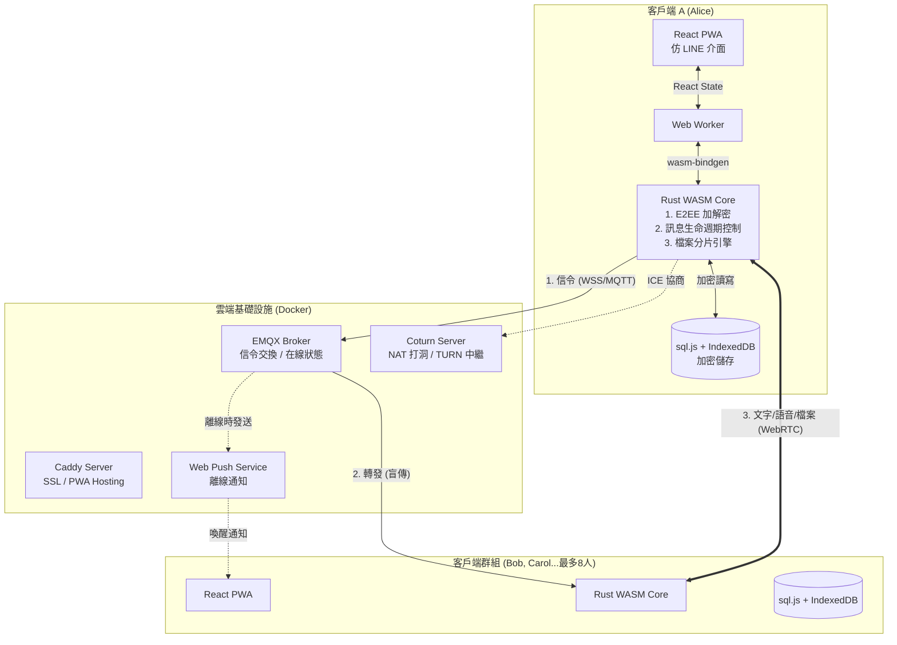

## 2. 技術棧詳解

### 2.1 前端層 (Presentation Layer)

| 技術 | 版本 | 用途 |
|------|------|------|
| React | 18.x | UI 框架 |
| TypeScript | 5.x | 型別安全 |
| Vite | 5.x | 建置工具 |
| TailwindCSS | 3.x | 樣式框架 |
| Zustand | 4.x | 狀態管理 |
| Workbox | 7.x | Service Worker / PWA |

**PWA 功能配置：**

```json
// manifest.json
{
  "name": "SafeTalk",
  "short_name": "SafeTalk",
  "display": "standalone",
  "start_url": "/",
  "theme_color": "#1a1a1a",
  "background_color": "#1a1a1a",
  "icons": [
    { "src": "/icon-192.png", "sizes": "192x192", "type": "image/png" },
    { "src": "/icon-512.png", "sizes": "512x512", "type": "image/png" }
  ]
}
```

### 2.2 核心邏輯層 (Core Layer)

| 技術 | 用途 |
|------|------|
| Rust | 核心邏輯語言 |
| wasm-pack | WASM 編譯工具 |
| wasm-bindgen | JS/WASM 綁定 |
| web-sys | Web API 綁定 |

**Rust Crates 依賴：**

```toml
# rust-core/Cargo.toml
[dependencies]
wasm-bindgen = "0.2"
web-sys = { version = "0.3", features = ["console", "Window"] }
js-sys = "0.3"
serde = { version = "1.0", features = ["derive"] }
serde_json = "1.0"

# 加密
x25519-dalek = "2.0"
ed25519-dalek = "2.0"
aes-gcm = "0.10"
sha2 = "0.10"
hkdf = "0.12"

# 資料庫
sql-js = "1.0"  # 自訂綁定
```

### 2.3 儲存層 (Storage Layer)

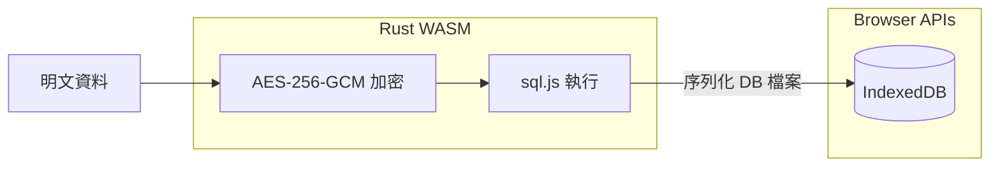

**儲存策略：**

| 資料類型 | 加密方式 | 儲存位置 |
|----------|----------|----------|
| 聊天記錄 | AES-256-GCM 欄位加密 | sql.js → IndexedDB |
| 私鑰 | WebAuthn 保護 + AES 加密 | IndexedDB |
| 附件檔案 | ChaCha20-Poly1305 串流加密 | IndexedDB (Blob) |
| 離線 App 資源 | 無需加密 | Cache API |

### 2.4 網路層 (Network Layer)

#### MQTT 信令

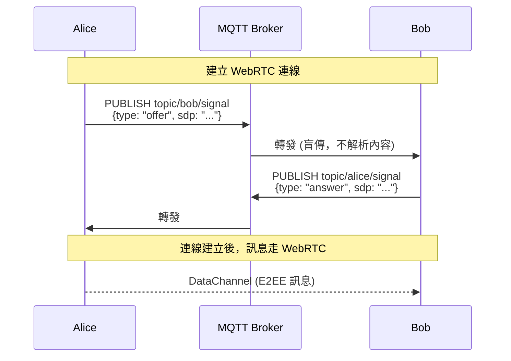

#### WebRTC 連線策略

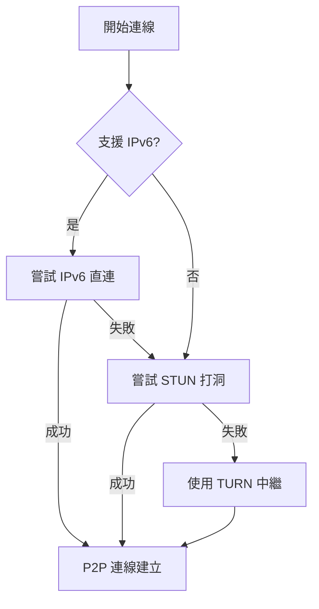

### 2.5 後端基礎設施

```yaml
# server/docker-compose.yml
version: '3.8'
services:
  caddy:
    image: caddy:2-alpine
    ports:
      - "80:80"
      - "443:443"
    volumes:
      - ./caddy/Caddyfile:/etc/caddy/Caddyfile
      - caddy_data:/data

  emqx:
    image: emqx/emqx:5
    ports:
      - "8083:8083"   # WSS
      - "18083:18083" # Dashboard
    volumes:
      - ./emqx/emqx.conf:/opt/emqx/etc/emqx.conf

  coturn:
    image: coturn/coturn:4
    ports:
      - "3478:3478/udp"
      - "3478:3478/tcp"
      - "5349:5349/tcp"  # TLS
    volumes:
      - ./coturn/turnserver.conf:/etc/turnserver.conf

volumes:
  caddy_data:
```

## 3. 加密協定

### 3.1 金鑰交換 (X3DH)

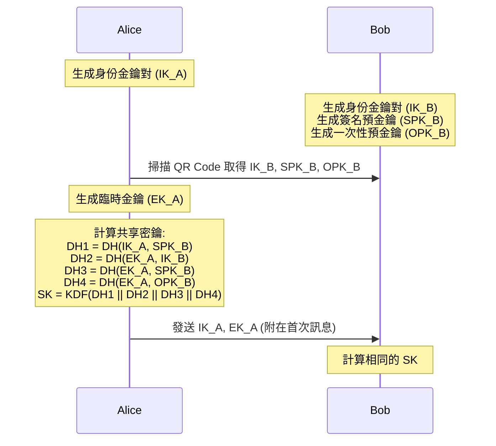

### 3.2 訊息加密 (Double Ratchet)

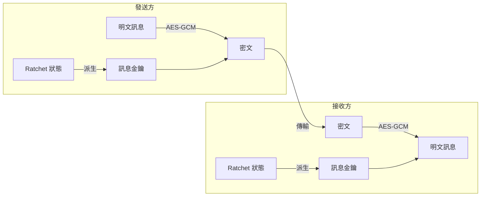

每則訊息使用不同金鑰，即使單一金鑰洩漏，也無法解密其他訊息。

## 4. 訊息生命週期控制

### 4.1 TTL 機制

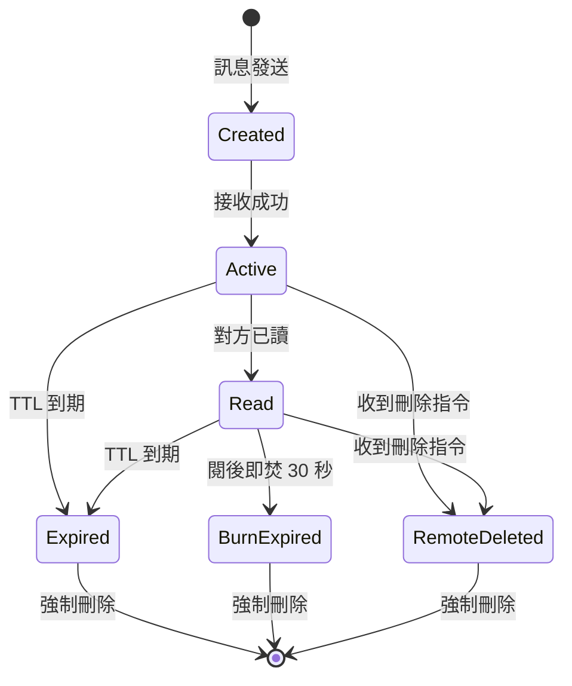

### 4.2 銷毀引擎

```rust
// 觸發時機：App 啟動 + 每 60 秒
pub struct DestructionEngine {
    db: Database,
    deletion_count: u32,
}

impl DestructionEngine {
    pub fn cleanup(&mut self) {
        let now = current_timestamp();

        // 1. TTL 到期
        let deleted = self.db.execute(
            "DELETE FROM messages WHERE expires_at IS NOT NULL AND expires_at < ?",
            [now]
        );
        self.deletion_count += deleted;

        // 2. 閱後即焚（已讀超過 30 秒）
        let deleted = self.db.execute(
            "DELETE FROM messages WHERE ttl = -1 AND read_at IS NOT NULL AND read_at < ?",
            [now - 30]
        );
        self.deletion_count += deleted;

        // 3. 物理清除（每 100 次刪除後）
        if self.deletion_count >= 100 {
            self.db.execute("VACUUM");
            self.deletion_count = 0;
        }
    }

    pub fn remote_delete(&mut self, message_id: &str) {
        self.db.execute("DELETE FROM messages WHERE id = ?", [message_id]);
        self.deletion_count += 1;
    }
}
```

## 5. 推播通知流程

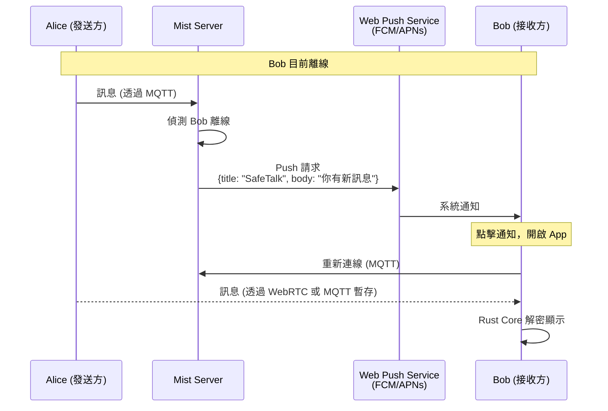

**重點：伺服器永遠不知道訊息內容**

## 6. 群組通訊架構

### 6.1 Full Mesh 拓撲（8 人以下）

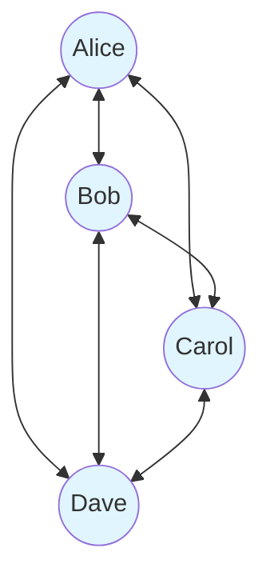

- 每人維護 N-1 條 WebRTC 連線
- 8 人 = 28 條連線
- 訊息直接 P2P 傳送，不經伺服器

### 6.2 檔案 Mesh 分享

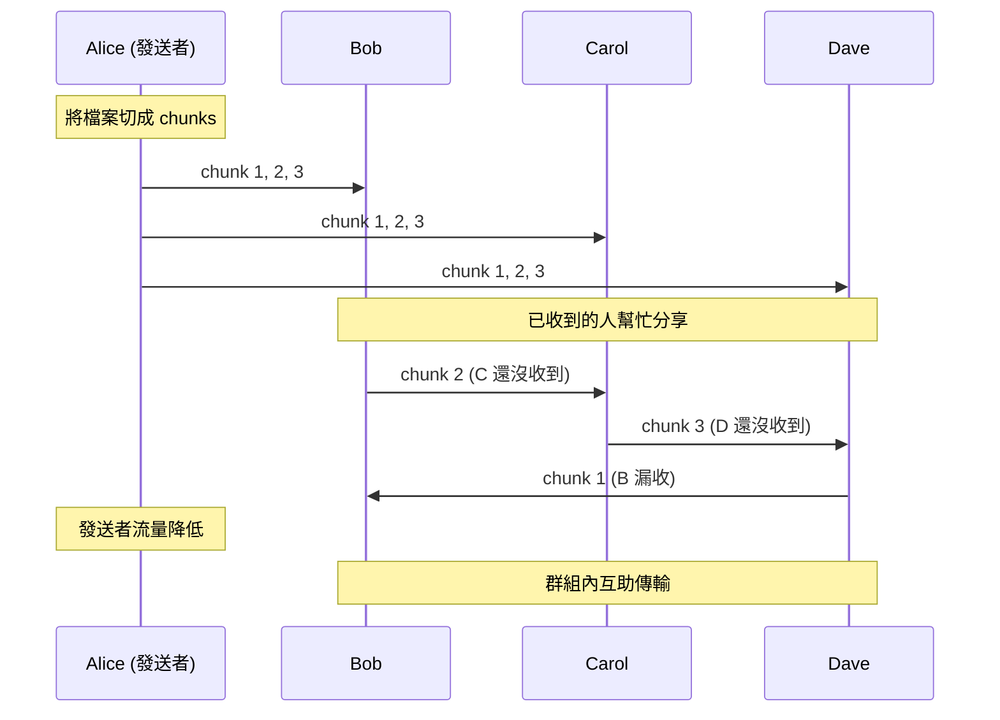

## 7. 好友系統架構

### 7.1 分層信任機制

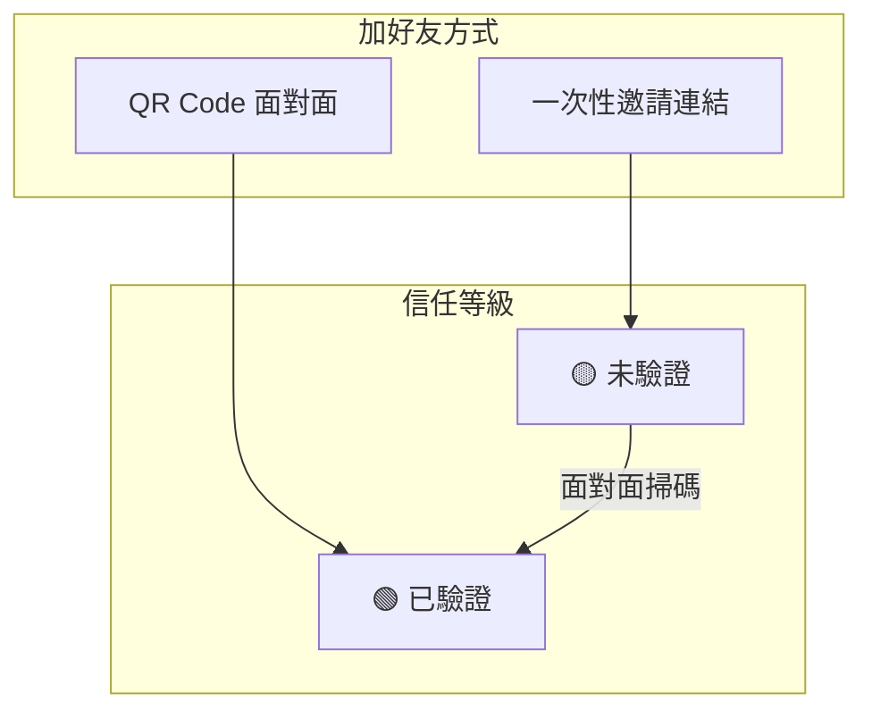

### 7.2 一次性邀請連結流程

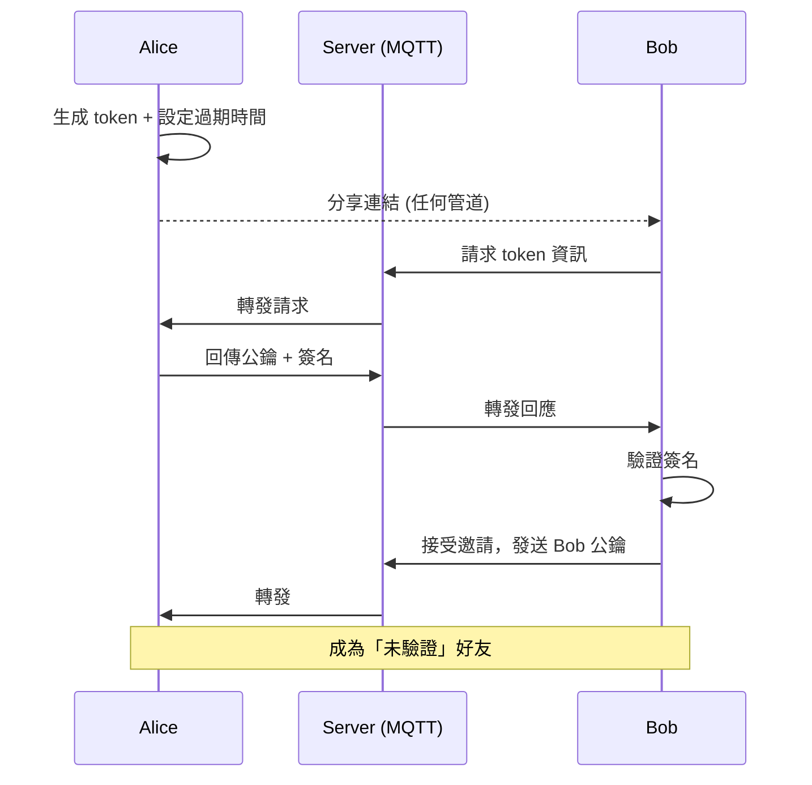

### 7.3 驗證升級流程

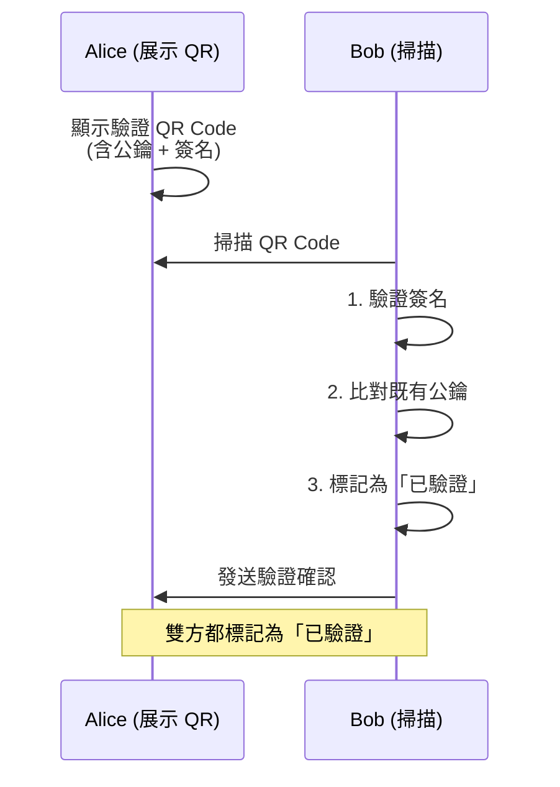

### 7.4 QR Code 資料格式

```json
// 新增好友 QR Code
{
  "v": 1,
  "type": "add",
  "pk": "base64_public_key",
  "sig": "base64_signature",
  "ts": 1702000000
}

// 驗證升級 QR Code
{
  "v": 1,
  "type": "verify",
  "pk": "base64_public_key",
  "fp": "A3F2 8B4C 91D7 E5A0",
  "ts": 1702000000,
  "sig": "base64_signature"
}
```

詳細設計請參考 [FRIEND_SYSTEM.md](FRIEND_SYSTEM.md)

## 8. 安全性設計

### 8.1 威脅模型

| 威脅 | 防禦措施 |
|------|----------|
| 中間人攻擊 (MITM) | 面對面 QR Code 驗證公鑰 |
| 伺服器被入侵 | 零知識設計，伺服器無法解密 |
| 裝置遺失 | 生物辨識鎖 + 遠端刪除 |
| 截圖洩漏 | 模糊保護 + 浮水印 |
| 訊息被轉發 | 訊息綁定對話 ID，無法跨對話驗證 |
| 邀請連結洩漏 | 一次性使用 + 可隨時作廢 |

### 8.2 金鑰生命週期

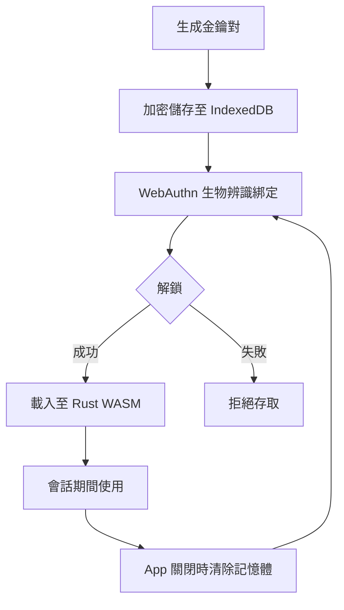

## 9. 效能考量

### 9.1 WASM 在 Web Worker 中執行

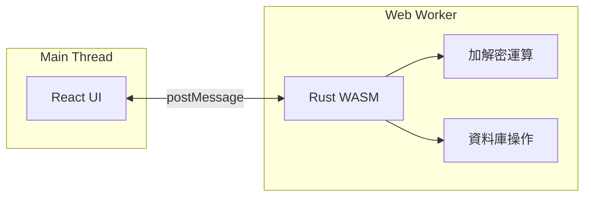

- 加解密不阻塞 UI
- 大量訊息處理不會卡頓

### 9.2 資料庫優化

```sql
-- 索引設計
CREATE INDEX idx_messages_conversation ON messages(conversation_id, created_at DESC);
CREATE INDEX idx_messages_expires ON messages(expires_at) WHERE expires_at IS NOT NULL;
CREATE INDEX idx_ratchet_peer ON ratchet_states(peer_pubkey);
```

## 10. VPS 部署資訊

### 伺服器配置

| 項目 | 值 |
|------|------|
| **IP** | `31.97.71.140` |
| **IPv6** | `2a02:4780:5e:a793::1` |
| **主機名** | `srv937047.hstgr.cloud` |
| **OS** | Ubuntu 24.04 with Docker |
| **規格** | KVM 2 (2 CPU, 8GB RAM, 100GB Disk) |

### 域名配置

| 域名 | 用途 |
|------|------|
| `mqtt.alwaysbefound.com` | MQTT WebSocket (WSS) |

### Docker 服務

| 容器 | 映像 | 端口 | 狀態 |
|------|------|------|------|
| **mist-emqx** | emqx/emqx:5.3 | 1883, 8083-8084, 18083 | ✅ Running |
| **mist-coturn** | coturn/coturn:4.6 | 3478, 5349, 49152-49200 | ✅ Running |
| **mist-caddy-mqtt** | caddy:2-alpine | 443 (反向代理) | ✅ Running |

### 防火牆規則 (Firewall ID: 105804)

| 端口 | 協議 | 用途 |
|------|------|------|
| 22 | TCP | SSH |
| 80, 443 | TCP | HTTP/HTTPS |
| 1883 | TCP | MQTT |
| 8083 | TCP | MQTT WebSocket |
| 3478 | UDP/TCP | STUN/TURN |
| 5349 | TCP | TURN over TLS |
| 49152-49200 | UDP | TURN 中繼端口 |

### 連線配置

```typescript
// 前端 MQTT 連線
const MQTT_BROKER = 'wss://mqtt.alwaysbefound.com/mqtt';

// WebRTC TURN 伺服器
const TURN_SERVER = {
  urls: 'turn:31.97.71.140:3478',
  username: 'mist',
  credential: 'mist_turn_2024',
};
```

---

## 11. 開發路線圖

### Phase 0: 技術驗證 ✅ 完成

- [x] Docker 環境部署 (Caddy + EMQX + Coturn)
- [x] React + Vite + TailwindCSS 專案建立
- [x] Rust WASM 整合
- [x] VPS 防火牆配置

### Phase 1: 基礎通訊 ✅ 大部分完成

- [x] 本機公私鑰生成
- [x] MQTT 連線與重連機制
- [x] 1 對 1 WebRTC 文字傳輸
- [x] 基本聊天 UI
- [x] PIN 認證畫面
- [x] 身份自動生成
- [x] 身份卡 UI（顯示公鑰）

### Phase 2: 安全與信任 🔄 進行中

- [x] QR Code 掃描與公鑰交換 (X3DH 格式統一)
- [ ] 一次性邀請連結功能
- [ ] 分層信任機制（已驗證/未驗證）
- [ ] 驗證升級流程
- [ ] X3DH + Double Ratchet 實作
- [ ] sql.js 加密儲存
- [ ] WebAuthn 生物辨識

### Phase 3: 高級功能

- [ ] 訊息生命週期控制（TTL + 閱後即焚）
- [ ] 遠端刪除指令
- [ ] WebRTC 語音通話
- [ ] 群組檔案 Mesh 傳輸
- [ ] 模糊保護 UI

### Phase 4: 商業化

- [ ] Web Push 通知
- [ ] 金流串接
- [ ] iOS Safari PWA 優化
- [ ] 正式上線
