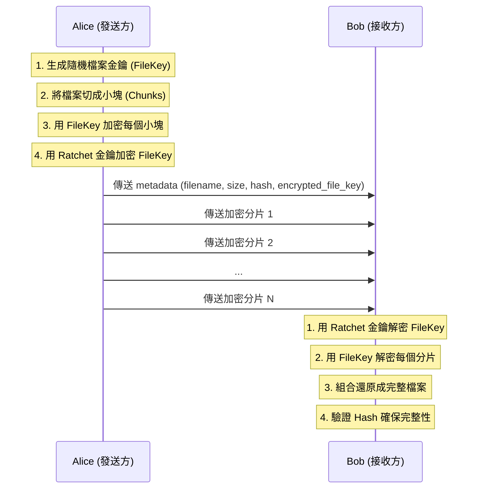
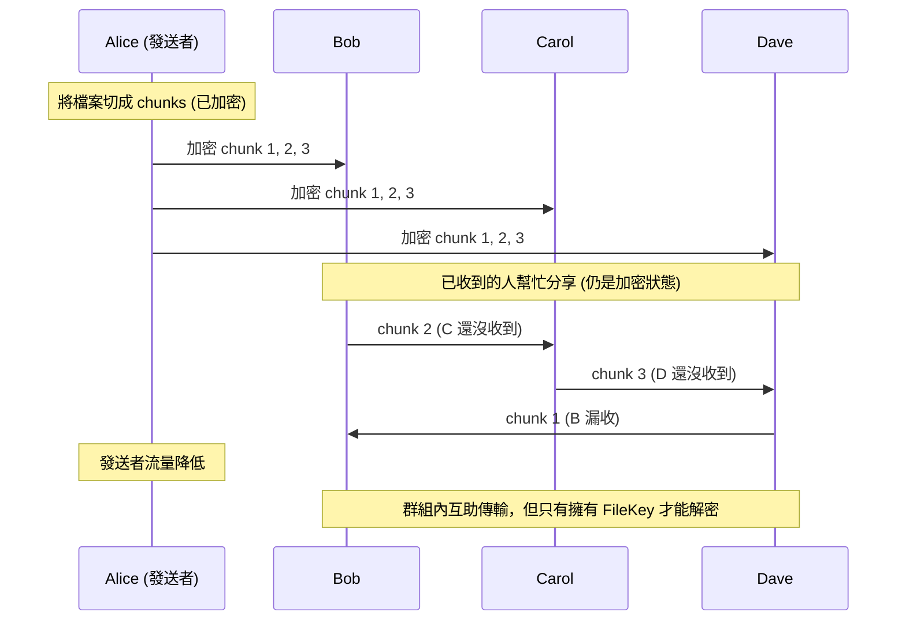

# Mist 檔案加密設計

本文件說明 Mist 如何加密傳輸各種檔案類型。

## 1. 檔案的本質

所有檔案（文字、圖片、影片、PDF）在電腦中都是二進位資料：

```
文字檔 (.txt)    →  01001000 01100101 01101100 ...
PDF 檔 (.pdf)    →  00100101 01010000 01000100 ...
影片檔 (.mp4)    →  00000000 00000000 00000000 ...
圖片檔 (.jpg)    →  11111111 11011000 11111111 ...
```

**任何檔案都可以加密，因為本質上都是數字。**

## 2. 加密流程圖解

```
原始檔案（任何類型）
┌──────────────────────────────────┐
│ 01001000 01100101 01101100 ...   │  ← 可讀取的資料
└──────────────────────────────────┘
                │
                │  加密（用金鑰打亂）
                ▼
┌──────────────────────────────────┐
│ 10111010 00101101 11010010 ...   │  ← 亂碼，沒金鑰無法還原
└──────────────────────────────────┘
                │
                │  解密（用金鑰還原）
                ▼
┌──────────────────────────────────┐
│ 01001000 01100101 01101100 ...   │  ← 還原成原本的檔案
└──────────────────────────────────┘
```

## 3. 加密層級

| 資料類型 | 加密演算法 | 說明 |
|----------|------------|------|
| 文字訊息 | AES-256-GCM | 直接用 Double Ratchet 訊息金鑰加密 |
| 檔案內容 | ChaCha20-Poly1305 | 串流加密，適合大檔案 |
| 檔案金鑰 | AES-256-GCM | 用 Ratchet 金鑰加密後傳送 |

## 4. 檔案加密傳輸流程



## 5. 分片策略

| 檔案大小 | 分片大小 | 說明 |
|----------|----------|------|
| < 1 MB | 不分片 | 直接加密傳輸 |
| 1-10 MB | 256 KB | 一般圖片、文件 |
| 10-100 MB | 1 MB | 長影片、大型 PDF |
| > 100 MB | 4 MB | 超大檔案 |

## 6. 為什麼要分片？

```
小檔案 (直接傳)
┌─────────────────┐
│   完整檔案       │ → 加密 → 一次傳完
└─────────────────┘

大檔案 (分片傳)
┌──────┬──────┬──────┬──────┬──────┐
│ 分片1 │ 分片2 │ 分片3 │ 分片4 │ 分片5 │
└──────┴──────┴──────┴──────┴──────┘
   ↓       ↓       ↓       ↓       ↓
  加密    加密    加密    加密    加密
   ↓       ↓       ↓       ↓       ↓
  傳輸    傳輸    傳輸    傳輸    傳輸
```

**優點：**
1. **記憶體效率**：不需要把整個大檔案載入記憶體
2. **斷點續傳**：網路中斷可以從上次的分片繼續
3. **Mesh 分享**：群組內其他人收到分片後可以幫忙轉傳

## 7. Rust 檔案加密實作

```rust
// rust-core/src/crypto/file.rs

use chacha20poly1305::{ChaCha20Poly1305, Key, Nonce, aead::Aead};
use sha2::{Sha256, Digest};

const CHUNK_SIZE: usize = 256 * 1024; // 256 KB

pub struct FileEncryptor {
    file_key: [u8; 32],
    chunk_index: u32,
}

impl FileEncryptor {
    /// 建立新的檔案加密器，自動生成隨機金鑰
    pub fn new() -> Self {
        let mut file_key = [0u8; 32];
        getrandom::getrandom(&mut file_key).unwrap();
        Self { file_key, chunk_index: 0 }
    }

    /// 加密單個分片
    pub fn encrypt_chunk(&mut self, plaintext: &[u8]) -> Vec<u8> {
        let cipher = ChaCha20Poly1305::new(Key::from_slice(&self.file_key));

        // 每個分片使用不同的 Nonce (基於 chunk_index)
        let mut nonce_bytes = [0u8; 12];
        nonce_bytes[..4].copy_from_slice(&self.chunk_index.to_le_bytes());
        let nonce = Nonce::from_slice(&nonce_bytes);

        self.chunk_index += 1;
        cipher.encrypt(nonce, plaintext).unwrap()
    }

    /// 取得加密後的檔案金鑰（用 Ratchet 金鑰加密）
    pub fn get_encrypted_file_key(&self, ratchet_key: &[u8; 32]) -> Vec<u8> {
        let cipher = aes_gcm::Aes256Gcm::new(aes_gcm::Key::from_slice(ratchet_key));
        let nonce = aes_gcm::Nonce::from_slice(&[0u8; 12]);
        cipher.encrypt(nonce, self.file_key.as_ref()).unwrap()
    }
}

pub struct FileDecryptor {
    file_key: [u8; 32],
    chunk_index: u32,
}

impl FileDecryptor {
    /// 從加密的檔案金鑰建立解密器
    pub fn from_encrypted_key(encrypted_key: &[u8], ratchet_key: &[u8; 32]) -> Self {
        let cipher = aes_gcm::Aes256Gcm::new(aes_gcm::Key::from_slice(ratchet_key));
        let nonce = aes_gcm::Nonce::from_slice(&[0u8; 12]);
        let file_key: [u8; 32] = cipher
            .decrypt(nonce, encrypted_key)
            .unwrap()
            .try_into()
            .unwrap();
        Self { file_key, chunk_index: 0 }
    }

    /// 解密單個分片
    pub fn decrypt_chunk(&mut self, ciphertext: &[u8]) -> Vec<u8> {
        let cipher = ChaCha20Poly1305::new(Key::from_slice(&self.file_key));

        let mut nonce_bytes = [0u8; 12];
        nonce_bytes[..4].copy_from_slice(&self.chunk_index.to_le_bytes());
        let nonce = Nonce::from_slice(&nonce_bytes);

        self.chunk_index += 1;
        cipher.decrypt(nonce, ciphertext).unwrap()
    }
}

/// 計算檔案 Hash（驗證完整性）
pub fn calculate_file_hash(data: &[u8]) -> String {
    let mut hasher = Sha256::new();
    hasher.update(data);
    let result = hasher.finalize();
    base64::encode(result)
}
```

## 8. 檔案 Metadata 格式

```typescript
interface FileMetadata {
    id: string;                    // 檔案唯一 ID
    filename: string;              // 原始檔名
    mime_type: string;             // MIME 類型 (image/jpeg, video/mp4, etc.)
    size: number;                  // 檔案大小 (bytes)
    chunk_count: number;           // 分片數量
    chunk_size: number;            // 每片大小
    hash: string;                  // SHA-256 Hash (驗證完整性)
    encrypted_file_key: string;    // 加密後的檔案金鑰 (Base64)
    ttl: number;                   // 存活時間
    created_at: number;            // 建立時間
}
```

## 9. 支援的檔案類型

| 類型 | 副檔名 | 加密方式 | 備註 |
|------|--------|----------|------|
| 圖片 | jpg, png, gif, webp | ChaCha20 | 支援預覽縮圖（縮圖也加密） |
| 影片 | mp4, mov, webm | ChaCha20 串流 | 需完整下載後才能播放 |
| 音訊 | mp3, m4a, ogg | ChaCha20 | 語音訊息也走此流程 |
| 文件 | pdf, doc, xlsx | ChaCha20 | 完整下載後才能開啟 |
| 其他 | * | ChaCha20 | 任意檔案皆可傳輸 |

## 10. 安全性保證

| 問題 | 解答 |
|------|------|
| 伺服器能看到檔案嗎？ | **不能**，檔案走 WebRTC P2P，且已加密 |
| 群組 Mesh 傳輸安全嗎？ | **安全**，分片都是加密的，只有擁有 FileKey 的人才能解密 |
| 中間人能竄改檔案嗎？ | **不能**，有 Hash 驗證完整性，任何竄改都會被偵測 |
| 檔案金鑰會洩漏嗎？ | **不會**，FileKey 用 Ratchet 金鑰加密傳輸 |

## 11. 群組檔案 Mesh 傳輸


