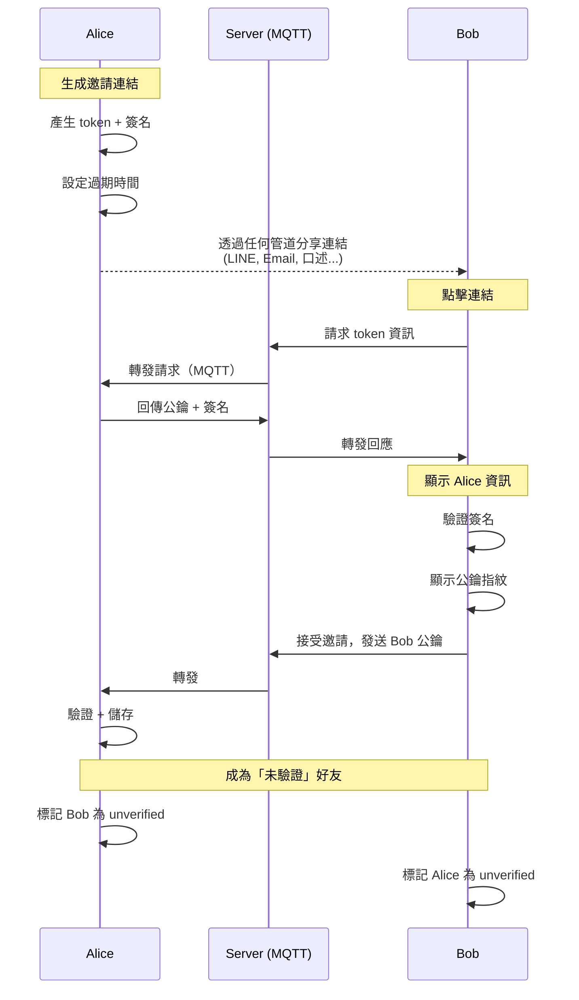
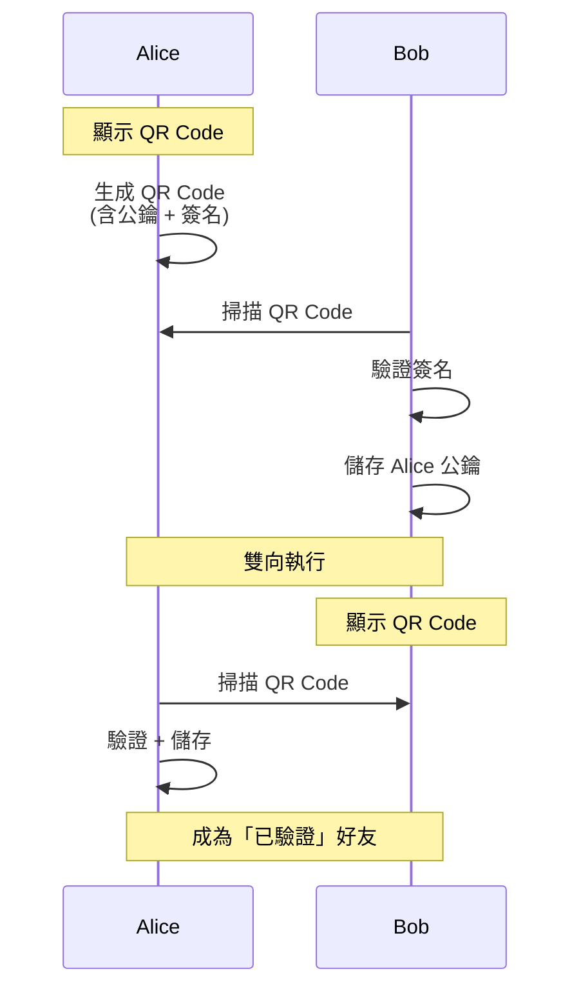

# Mist 好友系統設計

## 1. 設計理念

Mist 的好友系統採用「分層信任」機制，平衡安全性與便利性：

- **便利性**：支援線上邀請連結，無需見面即可加好友
- **安全性**：區分「已驗證」與「未驗證」好友，鼓勵面對面驗證
- **防濫用**：一次性邀請連結，防止 ID 流出被大量加好友

## 2. 信任等級

```
┌─────────────────────────────────────────────────────────┐
│                     好友信任等級                          │
├─────────────────────────────────────────────────────────┤
│  🟢 已驗證 (Verified)                                    │
│     • 透過 QR Code 面對面驗證                             │
│     • 完整功能                                           │
│     • 顯示綠色徽章 ✓                                      │
│                                                         │
│  🟡 未驗證 (Unverified)                                  │
│     • 透過線上邀請連結加入                                 │
│     • 基本聊天功能                                        │
│     • 顯示黃色提醒                                        │
│     • 可隨時升級為已驗證                                   │
└─────────────────────────────────────────────────────────┘
```

### 2.1 功能差異

| 功能 | 未驗證 🟡 | 已驗證 🟢 |
|------|----------|----------|
| 文字訊息 | ✅ | ✅ |
| 檔案傳輸 | ✅ | ✅ |
| 語音通話 | ✅ | ✅ |
| 加入群組 | ✅ | ✅ |
| 信任標記 | ⚠️ 未驗證提醒 | ✓ 綠色徽章 |

> 功能上無差異，但 UI 會持續提醒用戶進行驗證

## 3. 加好友方式

### 3.1 方式一：一次性邀請連結

適合：遠端加好友、網路認識的朋友

```
邀請連結格式：
https://mist.app/invite/{token}

token = base64url(random_bytes(16))
範例：https://mist.app/invite/a1b2c3d4e5f6g7h8
```

#### 邀請連結特性

| 屬性 | 說明 |
|------|------|
| 使用次數 | 1 次（使用後立即失效） |
| 有效期限 | 可選：5 分鐘 / 1 小時 / 24 小時 |
| 可作廢 | 用戶可隨時手動作廢 |
| 狀態追蹤 | 顯示「有效中 / 已使用 / 已過期 / 已作廢」 |

#### 邀請流程



#### 資料結構

```typescript
// 邀請連結資料
interface InviteLink {
  token: string;           // 唯一識別碼
  createdAt: number;       // 建立時間
  expiresAt: number;       // 過期時間
  status: 'active' | 'used' | 'expired' | 'revoked';
  usedBy?: string;         // 使用者公鑰（已使用時）
  usedAt?: number;         // 使用時間
}

// 儲存在本機
// 伺服器不儲存邀請連結內容
```

### 3.2 方式二：QR Code 面對面掃描

適合：建立最高信任等級、首次見面驗證



#### QR Code 內容格式

```json
{
  "v": 1,
  "type": "add",
  "pk": "base64_public_key",
  "sig": "base64_signature",
  "ts": 1702000000,
  "name": "Alice"
}
```

## 4. 驗證升級（未驗證 → 已驗證）

當兩人已是「未驗證」好友，見面時可升級為「已驗證」。

### 4.1 QR Code 掃描驗證

```
操作流程：

Alice 手機                              Bob 手機
┌─────────────────┐                    ┌─────────────────┐
│  好友詳情: Bob   │                    │  好友詳情: Alice│
│  🟡 未驗證       │                    │  🟡 未驗證       │
│                 │                    │                 │
│  [📷 掃碼驗證]   │                    │                 │
└─────────────────┘                    └─────────────────┘
        │                                     │
        ▼                                     │
┌─────────────────┐                           │
│  ┌───────────┐  │                           │
│  │  QR Code  │  │  ←── Bob 用相機掃描 ───────│
│  │ (驗證用)   │  │                           │
│  └───────────┘  │                           │
│                 │                           │
│  讓 Bob 掃描    │                           │
│  此 QR Code     │                           │
└─────────────────┘                           │
                                              ▼
                                    ┌─────────────────┐
                                    │  驗證成功！      │
                                    │                 │
                                    │  確認這是       │
                                    │  Alice 本人嗎？  │
                                    │                 │
                                    │  [是]    [否]   │
                                    └─────────────────┘
                                              │
        ┌─────────────────────────────────────┘
        │ Bob 點擊「是」
        ▼
┌─────────────────┐                    ┌─────────────────┐
│  好友詳情: Bob   │                    │  好友詳情: Alice│
│  🟢 已驗證 ✓     │                    │  🟢 已驗證 ✓     │
└─────────────────┘                    └─────────────────┘
```

### 4.2 驗證 QR Code 格式

```json
{
  "v": 1,
  "type": "verify",
  "pk": "base64_public_key",
  "fp": "A3F2 8B4C 91D7 E5A0",
  "ts": 1702000000,
  "sig": "base64_signature"
}
```

### 4.3 驗證邏輯

```typescript
async function verifyFriend(scannedData: VerifyQRData): Promise<boolean> {
  // 1. 驗證簽名
  const isValidSig = await verifySignature(
    scannedData.pk,
    scannedData.sig,
    `${scannedData.type}:${scannedData.pk}:${scannedData.ts}`
  );

  if (!isValidSig) {
    throw new Error('簽名驗證失敗');
  }

  // 2. 確認是現有好友
  const contact = await db.getContact(scannedData.pk);
  if (!contact) {
    throw new Error('此人不在好友列表中');
  }

  // 3. 確認公鑰匹配
  if (contact.pubkey !== scannedData.pk) {
    throw new Error('公鑰不匹配，可能遭受中間人攻擊');
  }

  // 4. 更新為已驗證
  await db.updateContact(scannedData.pk, {
    verified: 1,
    verifiedAt: Date.now(),
    verifiedMethod: 'qrcode'
  });

  // 5. 通知對方
  await sendVerificationConfirm(scannedData.pk);

  return true;
}
```

## 5. UI 設計

### 5.1 好友列表

```
┌────────────────────────────────────────┐
│  好友                            [+]    │
├────────────────────────────────────────┤
│                                        │
│  👤 Bob                    🟢 已驗證    │
│     上次上線：剛剛                       │
│                                        │
│  👤 Carol                  🟡 未驗證    │
│     上次上線：2 小時前       [驗證 →]    │
│                                        │
│  👤 David                  🟢 已驗證    │
│     上次上線：昨天                       │
│                                        │
└────────────────────────────────────────┘
```

### 5.2 未驗證好友聊天視窗

```
┌────────────────────────────────────────┐
│  ← Carol                               │
├────────────────────────────────────────┤
│  ┌────────────────────────────────┐    │
│  │ ⚠️ 此好友尚未驗證                │    │
│  │                                │    │
│  │ 建議見面時掃碼確認對方身份       │    │
│  │                                │    │
│  │         [立即驗證]             │    │
│  └────────────────────────────────┘    │
│                                        │
│  ┌──────────────────┐                  │
│  │ 嗨，我是 Carol    │                  │
│  └──────────────────┘                  │
│                                        │
│            ┌──────────────────┐        │
│            │ 你好！           │        │
│            └──────────────────┘        │
│                                        │
├────────────────────────────────────────┤
│  [輸入訊息...]                   [送出] │
└────────────────────────────────────────┘
```

### 5.3 好友詳情頁

```
┌────────────────────────────────────────┐
│  ← Carol                               │
├────────────────────────────────────────┤
│                                        │
│              [頭像]                    │
│              Carol                     │
│                                        │
│  ┌────────────────────────────────┐    │
│  │ ⚠️ 未驗證好友                   │    │
│  │                                │    │
│  │ 尚未確認此人身份                │    │
│  │ 建議見面時進行驗證              │    │
│  │                                │    │
│  │ [📷 掃碼驗證]                  │    │
│  └────────────────────────────────┘    │
│                                        │
│  ────────────────────────────────      │
│                                        │
│  公鑰指紋                              │
│  A3F2 8B4C 91D7 E5A0                   │
│  (可透過電話確認此指紋)                 │
│                                        │
│  ────────────────────────────────      │
│                                        │
│  💬 發送訊息                           │
│  📞 語音通話                           │
│  🗑️ 刪除好友                           │
│                                        │
└────────────────────────────────────────┘
```

### 5.4 邀請連結管理

```
┌────────────────────────────────────────┐
│  ← 邀請好友                            │
├────────────────────────────────────────┤
│                                        │
│  [+ 產生新邀請連結]                     │
│                                        │
│  ────────────────────────────────      │
│                                        │
│  我的邀請連結                          │
│                                        │
│  ┌────────────────────────────────┐    │
│  │ 🟢 有效中                       │    │
│  │ https://mist.app/invite/... │    │
│  │ 過期時間：1 小時後               │    │
│  │                                │    │
│  │ [複製] [分享] [作廢]            │    │
│  └────────────────────────────────┘    │
│                                        │
│  ┌────────────────────────────────┐    │
│  │ ✅ 已使用                       │    │
│  │ 使用者：Bob                     │    │
│  │ 使用時間：今天 14:30            │    │
│  └────────────────────────────────┘    │
│                                        │
│  ┌────────────────────────────────┐    │
│  │ ⏰ 已過期                       │    │
│  │ 過期時間：昨天 10:00            │    │
│  └────────────────────────────────┘    │
│                                        │
└────────────────────────────────────────┘
```

## 6. 資料庫設計

### 6.1 contacts 表擴展

```sql
-- 聯絡人
CREATE TABLE contacts (
    pubkey TEXT PRIMARY KEY,           -- 公鑰 (Base64)
    nickname TEXT,                     -- 暱稱
    avatar_hash TEXT,                  -- 頭像 Hash
    added_at INTEGER NOT NULL,         -- 加入時間
    added_method TEXT NOT NULL,        -- 加入方式: 'qrcode' | 'invite'

    -- 驗證狀態
    verified INTEGER DEFAULT 0,        -- 0=未驗證, 1=已驗證
    verified_at INTEGER,               -- 驗證時間
    verified_method TEXT,              -- 驗證方式: 'qrcode'

    -- 其他
    last_seen INTEGER,                 -- 最後上線時間
    blocked INTEGER DEFAULT 0          -- 是否封鎖
);

-- 索引
CREATE INDEX idx_contacts_verified ON contacts(verified);
CREATE INDEX idx_contacts_added ON contacts(added_at DESC);
```

### 6.2 invite_links 表

```sql
-- 邀請連結（本機儲存）
CREATE TABLE invite_links (
    token TEXT PRIMARY KEY,            -- 連結 token
    created_at INTEGER NOT NULL,       -- 建立時間
    expires_at INTEGER NOT NULL,       -- 過期時間
    status TEXT NOT NULL DEFAULT 'active', -- active | used | expired | revoked
    used_by TEXT,                      -- 使用者公鑰
    used_at INTEGER                    -- 使用時間
);

-- 索引
CREATE INDEX idx_invites_status ON invite_links(status);
CREATE INDEX idx_invites_expires ON invite_links(expires_at);
```

## 7. 安全考量

### 7.1 防止中間人攻擊

| 攻擊方式 | 防禦措施 |
|----------|----------|
| 偽造邀請連結 | 連結中不含公鑰，需透過 MQTT 交換 |
| 攔截公鑰交換 | 公鑰交換時附帶簽名驗證 |
| 冒充已有好友 | 驗證時比對既有公鑰 |

### 7.2 邀請連結安全

```
邀請連結流程中，Server 只能看到：
- 有人在請求某個 token
- 兩個用戶建立了聯繫

Server 看不到：
- 邀請連結內容
- 公鑰內容
- 用戶身份
```

### 7.3 驗證升級安全

```typescript
// QR Code 驗證時的安全檢查
const securityChecks = {
  // 1. 簽名驗證
  signatureValid: verifyEd25519(pubkey, signature, data),

  // 2. 時間戳檢查（防重放攻擊）
  timestampValid: Math.abs(Date.now() - qrData.ts) < 300000, // 5 分鐘內

  // 3. 公鑰匹配（確認是同一人）
  pubkeyMatch: existingContact.pubkey === qrData.pk,
};
```

## 8. 防濫用機制

### 8.1 邀請連結限制

| 限制 | 數值 |
|------|------|
| 同時有效連結數 | 最多 5 個 |
| 每日產生連結數 | 最多 20 個 |
| 最短有效期 | 5 分鐘 |
| 最長有效期 | 24 小時 |

### 8.2 未驗證好友限制

| 限制 | 數值 |
|------|------|
| 未驗證好友上限 | 20 人 |
| 超過上限處理 | 需先驗證現有好友 |

### 8.3 可疑行為偵測

```typescript
const suspiciousPatterns = {
  // 短時間大量發送邀請
  tooManyInvites: invitesLastHour > 10,

  // 連結被大量不同人使用（正常應該 1 對 1）
  // 這個不會發生，因為連結是一次性的

  // 被多人檢舉
  reportedByMany: reportCount > 3,
};

if (suspiciousPatterns.tooManyInvites) {
  // 暫時停用邀請功能 1 小時
  disableInviteFeature(userId, 3600);
}
```

## 9. 相關文件

- [技術架構](ARCHITECTURE.md)
- [系統設計](SYSTEM_DESIGN.md)
- [加密設計](FILE_ENCRYPTION.md)
