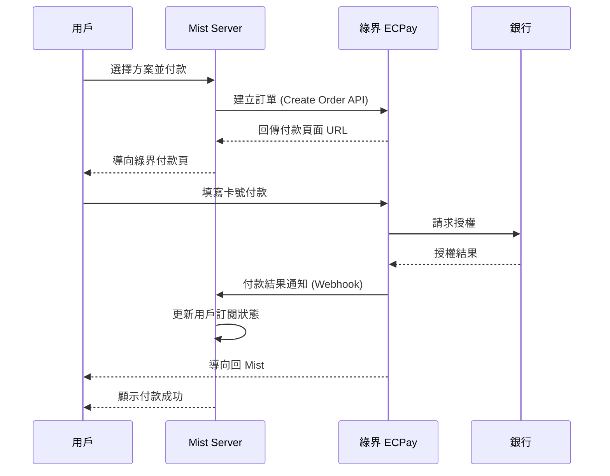
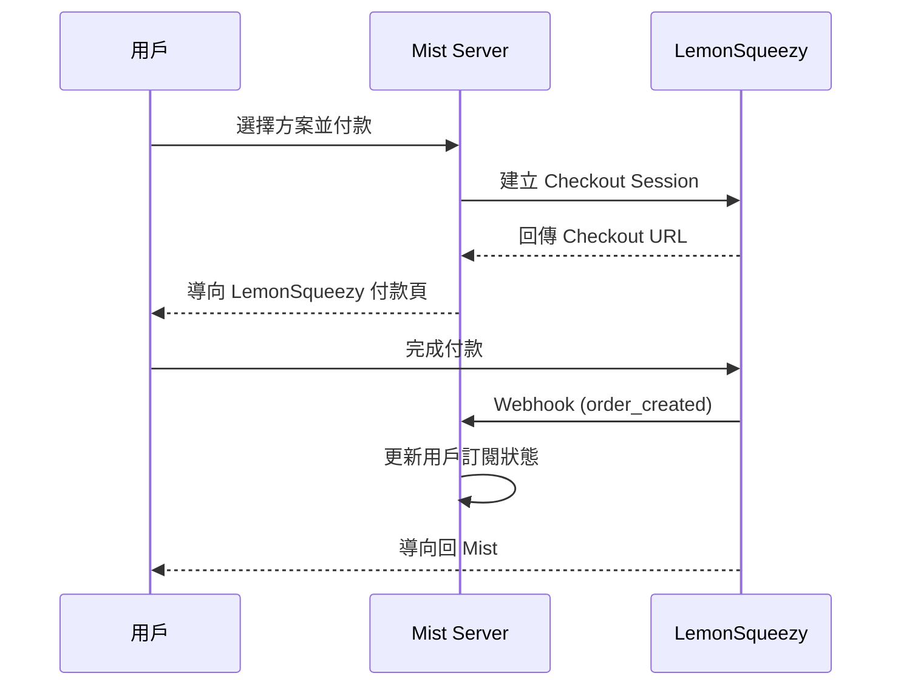

# Mist 金流設計 (Payment)

## 1. 商業模式

採用 **SaaS 年費制**，利用 P2P 的物理限制作為收費分級依據。

### 定價方案

| 方案 | 費用 | 好友上限 | 群組上限 | 功能 |
|------|------|----------|----------|------|
| **基本版** | NT$ 360/年 | 100 人 | 8 人 | 完整 P2P 功能 |
| **尊榮版** | NT$ 1,200/年 | 300+ 人 | 8 人 | 優先 TURN 頻寬 |

### 為什麼這樣定價？

- **好友數 = 潛在連線數 = 成本**
- 群組上限鎖定 8 人（WebRTC Full Mesh 效能極限）
- 使用網頁支付，避開 App Store 30% 抽成

## 2. 金流服務商選擇

### 策略：雙軌制

```
┌─────────────────────────────────────────────────────┐
│                      Mist 用戶                       │
└─────────────────────────────────────────────────────┘
                         │
            ┌────────────┴────────────┐
            ▼                         ▼
┌─────────────────────┐    ┌─────────────────────────┐
│   台灣用戶           │    │   國際用戶              │
│   (IP 偵測)         │    │   (其他地區)            │
└─────────────────────┘    └─────────────────────────┘
            │                         │
            ▼                         ▼
┌─────────────────────┐    ┌─────────────────────────┐
│   綠界 ECPay        │    │   LemonSqueezy          │
│   - 信用卡          │    │   - 信用卡 (全球)       │
│   - ATM 轉帳        │    │   - 自動處理國際稅務    │
│   - 超商繳費        │    │   - PayPal              │
└─────────────────────┘    └─────────────────────────┘
```

### 服務商比較

| 項目 | 綠界 ECPay | LemonSqueezy |
|------|-----------|--------------|
| **適用對象** | 台灣用戶 | 國際用戶 |
| **信用卡手續費** | 2.75% | 5% + 50¢ |
| **ATM/超商** | 支援 | 不支援 |
| **國際卡支援** | 部分 | 完整 |
| **自動稅務處理** | 無 | VAT/GST |
| **訂閱管理** | 需自建 | 內建 |
| **申請門檻** | 台灣公司/個人 | 個人即可 |
| **撥款週期** | 月結 | 週結 |

## 3. 綠界 ECPay 整合

### 支援付款方式

| 方式 | 手續費 | 說明 |
|------|--------|------|
| 信用卡 | 2.75% | Visa、MasterCard、JCB |
| ATM 轉帳 | NT$ 15/筆 | 虛擬帳號 |
| 超商代碼 | NT$ 27-32/筆 | 7-11、全家等 |
| 超商條碼 | NT$ 20/筆 | 條碼繳費 |

### 流程圖



### 環境變數

```env
# .env.local
ECPAY_MERCHANT_ID=你的商店代號
ECPAY_HASH_KEY=你的HashKey
ECPAY_HASH_IV=你的HashIV
ECPAY_RETURN_URL=https://mist.app/payment/callback
ECPAY_NOTIFY_URL=https://mist.app/api/payment/ecpay/notify
```

### API 端點

| 端點 | 方法 | 說明 |
|------|------|------|
| `/api/payment/ecpay/create` | POST | 建立綠界訂單 |
| `/api/payment/ecpay/notify` | POST | 接收付款通知 (Webhook) |
| `/api/payment/ecpay/return` | GET | 付款後返回頁面 |

## 4. LemonSqueezy 整合

### 優勢

1. **不需公司登記** - 個人即可收款
2. **全球信用卡** - Visa、MasterCard、AMEX
3. **自動處理稅務** - 歐盟 VAT、各國 GST
4. **內建訂閱管理** - 自動續費、取消、退款
5. **Merchant of Record** - 他們作為賣方，處理法律問題

### 流程圖



### 環境變數

```env
# .env.local
LEMONSQUEEZY_API_KEY=你的API金鑰
LEMONSQUEEZY_STORE_ID=你的商店ID
LEMONSQUEEZY_WEBHOOK_SECRET=Webhook密鑰
LEMONSQUEEZY_BASIC_VARIANT_ID=基本版產品ID
LEMONSQUEEZY_PREMIUM_VARIANT_ID=尊榮版產品ID
```

### API 端點

| 端點 | 方法 | 說明 |
|------|------|------|
| `/api/payment/lemonsqueezy/checkout` | POST | 建立 Checkout |
| `/api/payment/lemonsqueezy/webhook` | POST | 接收 Webhook |
| `/api/payment/lemonsqueezy/portal` | GET | 客戶管理入口 |

### Webhook 事件

| 事件 | 處理 |
|------|------|
| `order_created` | 建立訂閱記錄 |
| `subscription_created` | 啟用訂閱 |
| `subscription_updated` | 更新方案 |
| `subscription_cancelled` | 標記取消 |
| `subscription_expired` | 停用功能 |

## 5. 資料庫設計

### 訂閱表 (subscriptions)

```sql
CREATE TABLE subscriptions (
    id TEXT PRIMARY KEY,
    user_pubkey TEXT NOT NULL,           -- 用戶公鑰
    plan TEXT NOT NULL,                  -- 'basic' | 'premium'
    status TEXT NOT NULL,                -- 'active' | 'cancelled' | 'expired'
    provider TEXT NOT NULL,              -- 'ecpay' | 'lemonsqueezy'
    provider_subscription_id TEXT,       -- 金流商訂閱ID
    current_period_start INTEGER,        -- 當期開始時間
    current_period_end INTEGER,          -- 當期結束時間
    friend_limit INTEGER NOT NULL,       -- 好友上限
    created_at INTEGER NOT NULL,
    updated_at INTEGER NOT NULL,

    FOREIGN KEY (user_pubkey) REFERENCES users(pubkey)
);

CREATE INDEX idx_subscriptions_user ON subscriptions(user_pubkey);
CREATE INDEX idx_subscriptions_status ON subscriptions(status);
CREATE INDEX idx_subscriptions_end ON subscriptions(current_period_end);
```

### 付款記錄表 (payments)

```sql
CREATE TABLE payments (
    id TEXT PRIMARY KEY,
    subscription_id TEXT NOT NULL,
    amount INTEGER NOT NULL,             -- 金額（最小單位）
    currency TEXT NOT NULL,              -- 'TWD' | 'USD'
    status TEXT NOT NULL,                -- 'pending' | 'completed' | 'failed'
    provider TEXT NOT NULL,              -- 'ecpay' | 'lemonsqueezy'
    provider_payment_id TEXT,            -- 金流商付款ID
    created_at INTEGER NOT NULL,

    FOREIGN KEY (subscription_id) REFERENCES subscriptions(id)
);
```

## 6. 地區判斷

```typescript
// services/geo.ts
export async function detectRegion(): Promise<'TW' | 'INTL'> {
  // 方法 1: 使用免費 IP API
  try {
    const res = await fetch('https://ipapi.co/country/');
    const country = await res.text();
    return country === 'TW' ? 'TW' : 'INTL';
  } catch {
    // 方法 2: 使用時區判斷
    const tz = Intl.DateTimeFormat().resolvedOptions().timeZone;
    return tz === 'Asia/Taipei' ? 'TW' : 'INTL';
  }
}
```

## 7. 訂閱狀態檢查

```typescript
// services/subscription.ts
export async function checkSubscription(userPubkey: string): Promise<{
  isActive: boolean;
  plan: 'free' | 'basic' | 'premium';
  friendLimit: number;
  expiresAt: number | null;
}> {
  const sub = await db.subscriptions.get(userPubkey);

  if (!sub || sub.status !== 'active') {
    return {
      isActive: false,
      plan: 'free',
      friendLimit: 10, // 免費版限制
      expiresAt: null,
    };
  }

  return {
    isActive: true,
    plan: sub.plan,
    friendLimit: sub.friend_limit,
    expiresAt: sub.current_period_end,
  };
}
```

## 8. 安全注意事項

### Webhook 驗證

- **綠界**：驗證 CheckMacValue
- **LemonSqueezy**：驗證 HMAC-SHA256 簽名

### 防止重複處理

使用 idempotency key，記錄已處理的 webhook event ID。

## 9. 測試環境

### 綠界測試

| 項目 | 值 |
|------|------|
| 測試商店代號 | 3002607 |
| 測試 HashKey | pwFHCqoQZGmho4w6 |
| 測試 HashIV | EkRm7iFT261dpevs |
| 測試信用卡號 | 4311-9522-2222-2222 |
| 有效期限 | 任意未過期 |
| CVV | 222 |

### LemonSqueezy 測試

1. 在 Dashboard 開啟 Test Mode
2. 使用測試卡號：4242 4242 4242 4242
3. 有效期限：任意未來日期
4. CVV：任意 3 碼

## 10. 實作優先級

| 階段 | 任務 | 優先級 |
|------|------|--------|
| Phase 4.1 | 建立定價頁面 UI | P0 |
| Phase 4.1 | 整合 LemonSqueezy（較簡單） | P0 |
| Phase 4.2 | 整合綠界 ECPay | P1 |
| Phase 4.2 | 實作地區自動偵測 | P1 |
| Phase 4.3 | 訂閱管理頁面 | P1 |
| Phase 4.3 | 到期提醒通知 | P2 |
