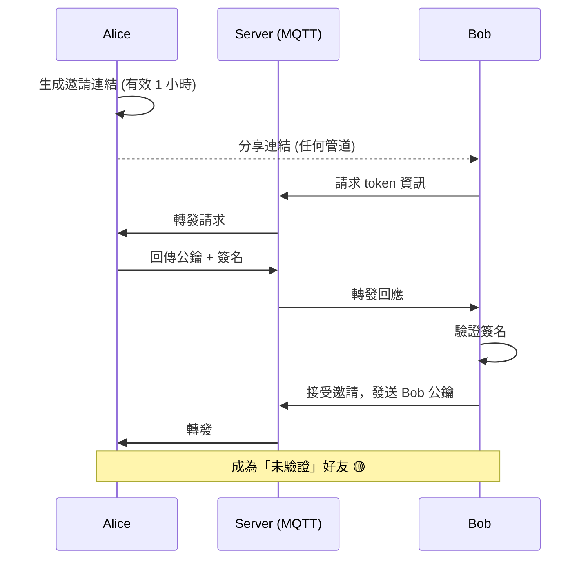
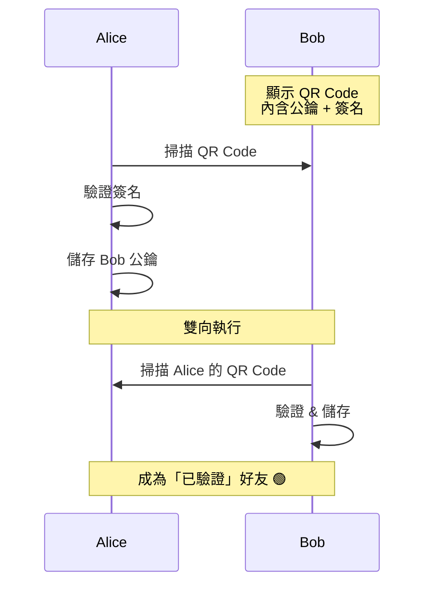
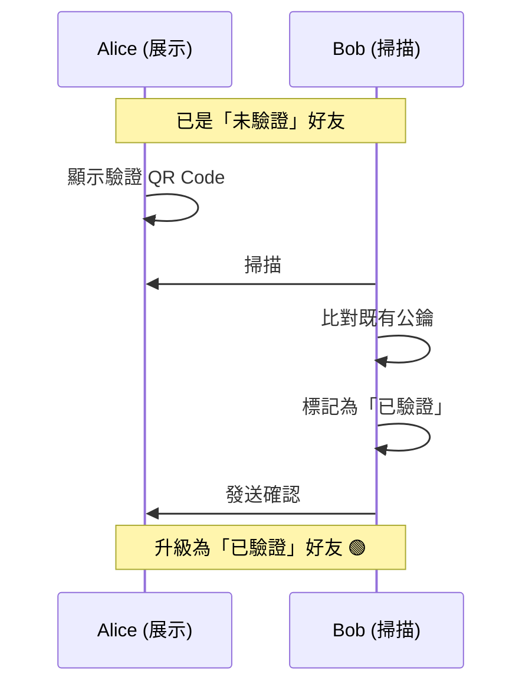
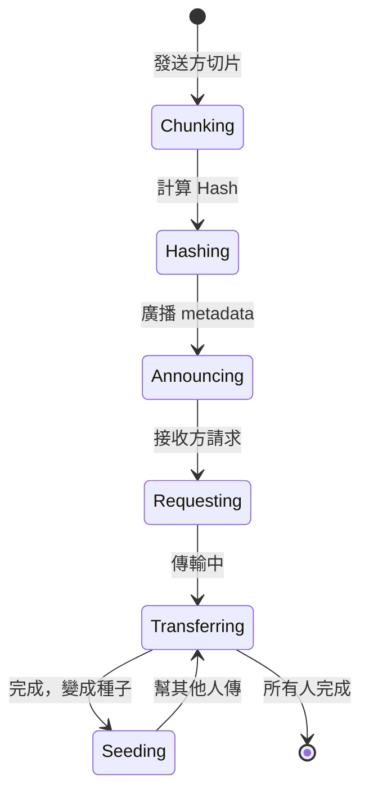
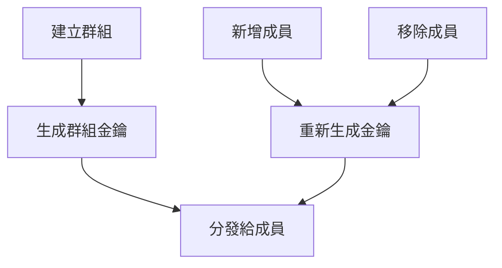
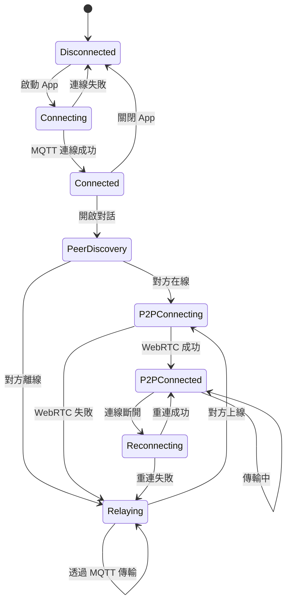
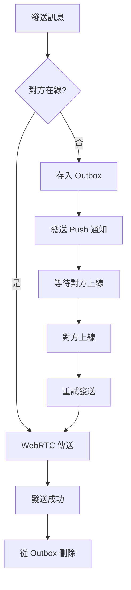
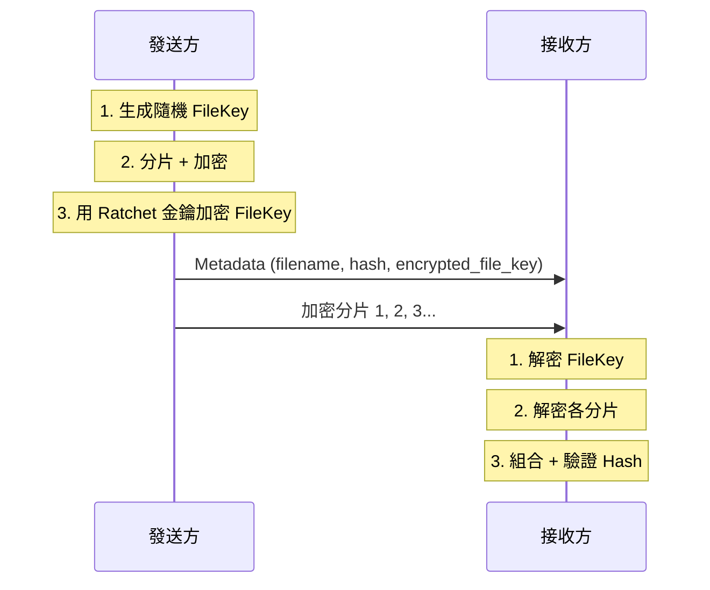

# Mist 系統設計文件

## 1. 產品定位

### 1.1 核心價值

> 「朦朧之中，只有你我」

Mist 是一款面向高隱私需求用戶的通訊應用，採用 PWA 技術實現真正的跨平台。

### 1.2 目標用戶

- 重視隱私的個人用戶
- 需要安全通訊的企業團隊
- 不信任傳統通訊軟體的技術愛好者

### 1.3 隱私哲學

| 原則 | 說明 |
|------|------|
| **零信任** | 伺服器不儲存金鑰、不儲存訊息、不認識使用者 |
| **去中心化** | 以公鑰為唯一 ID，P2P 直接傳輸 |
| **物理驗證** | 絕對的信任建立在面對面之上 |

## 2. 功能規格

### 2.1 隱私與安全功能

#### 2.1.1 生物辨識鎖 (Bio-Lock)

**流程：**
```
App 啟動 → WebAuthn 驗證 → 成功 → 解密私鑰 → 進入 App
                         → 失敗 → 拒絕存取
```

**技術實現：**
- 使用 Web Authentication API (WebAuthn)
- 私鑰加密金鑰與生物辨識綁定
- 支援指紋、FaceID、Windows Hello

#### 2.1.2 好友系統 (分層信任)

Mist 採用「分層信任」機制，平衡安全性與便利性。

**信任等級：**

| 等級 | 符號 | 加入方式 | 說明 |
|------|------|----------|------|
| 已驗證 | 🟢 | QR Code 面對面 | 最高信任，確認真人身份 |
| 未驗證 | 🟡 | 一次性邀請連結 | 線上加好友，可之後升級 |

**方式一：一次性邀請連結**



邀請連結特性：
- 使用後立即失效（一次性）
- 可設過期時間（5 分鐘 / 1 小時 / 24 小時）
- 可隨時手動作廢

**方式二：QR Code 面對面**



**驗證升級（未驗證 → 已驗證）**

見面時，掃描對方的驗證 QR Code 即可升級：



**QR Code 內容格式：**
```json
// 新增好友
{
  "v": 1,
  "type": "add",
  "pk": "base64_encoded_public_key",
  "sig": "base64_encoded_signature",
  "ts": 1702000000
}

// 驗證升級
{
  "v": 1,
  "type": "verify",
  "pk": "base64_encoded_public_key",
  "fp": "A3F2 8B4C 91D7 E5A0",
  "sig": "base64_encoded_signature",
  "ts": 1702000000
}
```

詳細設計請參考 [FRIEND_SYSTEM.md](FRIEND_SYSTEM.md)

#### 2.1.3 防窺視設計 (Anti-Peeping)

| 功能 | 實現方式 |
|------|----------|
| **預設模糊** | CSS `filter: blur(10px)` 覆蓋聊天內容 |
| **長按顯影** | `onTouchStart` 移除模糊，`onTouchEnd` 恢復 |
| **浮水印** | Canvas 繪製對方 ID，半透明覆蓋 |
| **截圖對抗** | 模糊狀態下截圖無效 |

**程式碼示意：**
```tsx
function MessageBubble({ message, peerId }) {
  const [revealed, setRevealed] = useState(false);

  return (
    <div
      className={revealed ? '' : 'blur-lg'}
      onTouchStart={() => setRevealed(true)}
      onTouchEnd={() => setRevealed(false)}
      onMouseDown={() => setRevealed(true)}
      onMouseUp={() => setRevealed(false)}
    >
      {message.content}
      <Watermark text={peerId} />
    </div>
  );
}
```

#### 2.1.4 訊息生命週期控制

**TTL 選項：**

| 選項 | 數值 | 說明 |
|------|------|------|
| 閱後即焚 | `-1` | 已讀 30 秒後刪除 |
| 1 小時 | `3600` | 發送後 1 小時刪除 |
| 1 天 | `86400` | 發送後 24 小時刪除 |
| 1 週 | `604800` | 發送後 7 天刪除 |
| 1 個月 | `2592000` | 發送後 30 天刪除 |
| 永久 | `0` | 不自動刪除（仍可遠端刪除） |

**刪除指令格式：**
```json
{
  "cmd": "DELETE",
  "message_ids": ["msg_123", "msg_456"],
  "timestamp": 1702000000,
  "signature": "base64_signature"
}
```

**強制執行保證：**
- 刪除邏輯在 Rust WASM 層執行
- UI 層無法攔截或取消
- 定期 VACUUM 確保物理刪除

### 2.2 通訊功能

#### 2.2.1 文字訊息

**訊息格式：**
```json
{
  "id": "uuid",
  "type": "text",
  "conversation_id": "conv_123",
  "sender": "public_key_base64",
  "ciphertext": "encrypted_content_base64",
  "ttl": 86400,
  "created_at": 1702000000,
  "header": {
    "dh": "ratchet_public_key",
    "pn": 5,
    "n": 12
  }
}
```

#### 2.2.2 語音通話

**WebRTC 配置：**
```javascript
const rtcConfig = {
  iceServers: [
    { urls: 'stun:stun.safetalk.app:3478' },
    {
      urls: 'turn:turn.safetalk.app:3478',
      username: 'user',
      credential: 'pass'
    }
  ],
  iceTransportPolicy: 'all', // 優先 P2P
  bundlePolicy: 'max-bundle',
  rtcpMuxPolicy: 'require'
};
```

**音訊編碼：**
- Codec: Opus
- Bitrate: 32kbps (省流量模式) / 64kbps (高品質)
- 加密: DTLS-SRTP (WebRTC 內建)

#### 2.2.3 檔案傳輸

**分片策略：**
```
檔案大小          分片大小
< 1 MB           不分片，直接傳
1-10 MB          256 KB
10-100 MB        1 MB
> 100 MB         4 MB
```

**Mesh 傳輸協定：**


#### 2.2.4 群組聊天

**限制：**
- 最大 8 人
- Full Mesh 拓撲
- 每人維護 N-1 條連線

**群組金鑰管理：**


## 3. 資料模型

### 3.1 資料庫 Schema

```sql
-- 聯絡人
CREATE TABLE contacts (
    pubkey TEXT PRIMARY KEY,           -- 公鑰 (Base64)
    nickname TEXT,                     -- 暱稱
    avatar_hash TEXT,                  -- 頭像 Hash
    added_at INTEGER NOT NULL,         -- 加入時間
    verified INTEGER DEFAULT 0,        -- 是否面對面驗證
    last_seen INTEGER,                 -- 最後上線時間
    trust_level INTEGER DEFAULT 1      -- 信任等級
);

-- 對話
CREATE TABLE conversations (
    id TEXT PRIMARY KEY,
    type TEXT NOT NULL CHECK(type IN ('direct', 'group')),
    name TEXT,                         -- 群組名稱 (群組才有)
    created_at INTEGER NOT NULL,
    updated_at INTEGER NOT NULL,
    unread_count INTEGER DEFAULT 0,
    muted INTEGER DEFAULT 0,
    pinned INTEGER DEFAULT 0
);

-- 對話成員 (群組用)
CREATE TABLE conversation_members (
    conversation_id TEXT NOT NULL,
    pubkey TEXT NOT NULL,
    role TEXT DEFAULT 'member' CHECK(role IN ('admin', 'member')),
    joined_at INTEGER NOT NULL,
    PRIMARY KEY (conversation_id, pubkey),
    FOREIGN KEY (conversation_id) REFERENCES conversations(id),
    FOREIGN KEY (pubkey) REFERENCES contacts(pubkey)
);

-- 訊息
CREATE TABLE messages (
    id TEXT PRIMARY KEY,
    conversation_id TEXT NOT NULL,
    sender_pubkey TEXT NOT NULL,
    type TEXT NOT NULL CHECK(type IN ('text', 'image', 'file', 'audio', 'system')),
    ciphertext BLOB NOT NULL,          -- 加密內容
    created_at INTEGER NOT NULL,
    ttl INTEGER NOT NULL DEFAULT 0,    -- 0=永久, -1=閱後即焚
    expires_at INTEGER,                -- TTL 到期時間
    read_at INTEGER,                   -- 已讀時間
    delivered_at INTEGER,              -- 送達時間
    FOREIGN KEY (conversation_id) REFERENCES conversations(id)
);

-- Ratchet 狀態 (每個對話一份)
CREATE TABLE ratchet_states (
    conversation_id TEXT PRIMARY KEY,
    peer_pubkey TEXT NOT NULL,
    state_blob BLOB NOT NULL,          -- 序列化的 Ratchet 狀態
    updated_at INTEGER NOT NULL,
    FOREIGN KEY (conversation_id) REFERENCES conversations(id)
);

-- 待發送訊息佇列 (離線時暫存)
CREATE TABLE outbox (
    id TEXT PRIMARY KEY,
    conversation_id TEXT NOT NULL,
    message_blob BLOB NOT NULL,
    created_at INTEGER NOT NULL,
    retry_count INTEGER DEFAULT 0,
    FOREIGN KEY (conversation_id) REFERENCES conversations(id)
);

-- 附件暫存
CREATE TABLE attachments (
    hash TEXT PRIMARY KEY,             -- SHA256 Hash
    ciphertext BLOB NOT NULL,
    mime_type TEXT NOT NULL,
    size INTEGER NOT NULL,
    created_at INTEGER NOT NULL,
    expires_at INTEGER
);

-- 索引
CREATE INDEX idx_messages_conv ON messages(conversation_id, created_at DESC);
CREATE INDEX idx_messages_expires ON messages(expires_at) WHERE expires_at IS NOT NULL;
CREATE INDEX idx_messages_read ON messages(read_at) WHERE ttl = -1 AND read_at IS NOT NULL;
CREATE INDEX idx_outbox_retry ON outbox(retry_count, created_at);
```

### 3.2 Rust 結構體

```rust
// 訊息
#[derive(Serialize, Deserialize)]
pub struct Message {
    pub id: String,
    pub conversation_id: String,
    pub sender_pubkey: Vec<u8>,
    pub message_type: MessageType,
    pub ciphertext: Vec<u8>,
    pub created_at: i64,
    pub ttl: i32,
    pub expires_at: Option<i64>,
    pub read_at: Option<i64>,
}

#[derive(Serialize, Deserialize)]
pub enum MessageType {
    Text,
    Image,
    File,
    Audio,
    System,
}

// Double Ratchet 狀態
#[derive(Serialize, Deserialize)]
pub struct RatchetState {
    pub dhs: KeyPair,           // 我方 DH 金鑰對
    pub dhr: Option<PublicKey>, // 對方 DH 公鑰
    pub rk: [u8; 32],           // Root Key
    pub cks: Option<[u8; 32]>,  // 發送 Chain Key
    pub ckr: Option<[u8; 32]>,  // 接收 Chain Key
    pub ns: u32,                // 發送訊息計數
    pub nr: u32,                // 接收訊息計數
    pub pn: u32,                // 上一鏈的訊息數
    pub mkskipped: HashMap<(Vec<u8>, u32), [u8; 32]>, // 跳過的訊息金鑰
}

// 刪除指令
#[derive(Serialize, Deserialize)]
pub struct DeleteCommand {
    pub cmd: String,
    pub message_ids: Vec<String>,
    pub timestamp: i64,
    pub signature: Vec<u8>,
}
```

## 4. API 設計

### 4.1 MQTT Topics

| Topic | 方向 | 用途 |
|-------|------|------|
| `u/{pubkey}/signal` | 入站 | 接收 WebRTC 信令 |
| `u/{pubkey}/cmd` | 入站 | 接收控制指令 (刪除等) |
| `u/{pubkey}/presence` | 雙向 | 在線狀態 |
| `g/{group_id}/signal` | 雙向 | 群組信令 |

### 4.2 控制指令格式

```typescript
// 刪除訊息
interface DeleteCommand {
  cmd: 'DELETE';
  message_ids: string[];
  timestamp: number;
  signature: string; // 簽名防偽造
}

// 已讀回報
interface ReadCommand {
  cmd: 'READ';
  message_ids: string[];
  timestamp: number;
}

// 打字中
interface TypingCommand {
  cmd: 'TYPING';
  conversation_id: string;
  is_typing: boolean;
}
```

### 4.3 WebRTC DataChannel 訊息

```typescript
interface DataChannelMessage {
  type: 'text' | 'file_meta' | 'file_chunk' | 'ack';
  payload: string; // Base64 encoded ciphertext
  id: string;
  seq?: number; // 檔案分片序號
}
```

## 5. 連線狀態機



## 6. 平台特定處理

### 6.1 iOS Safari

| 限制 | 處理方式 |
|------|----------|
| 背景執行 30 秒 | 接受，依賴 Push 喚醒 |
| 需加到主畫面才能推播 | UI 引導用戶操作 |
| 無法禁止截圖 | 依賴模糊保護 |

### 6.2 Android Chrome

| 功能 | 支援度 |
|------|--------|
| 安裝 PWA | ✅ 完整 |
| 推播通知 | ✅ 完整 |
| 背景執行 | ✅ Service Worker |
| 生物辨識 | ✅ WebAuthn |

### 6.3 Desktop (Windows/macOS)

| 功能 | 支援度 |
|------|--------|
| 安裝 PWA | ✅ Chrome/Edge |
| 推播通知 | ✅ 系統通知 |
| 生物辨識 | ✅ Windows Hello / Touch ID |

## 7. 商業模式

### 7.1 定價方案

| 方案 | 費用 | 好友上限 | 群組上限 | 功能 |
|------|------|----------|----------|------|
| **基本版** | NT$ 360/年 | 100 人 | 8 人 | 完整 P2P 功能 |
| **尊榮版** | NT$ 1,200/年 | 300+ 人 | 8 人 | 優先 TURN 頻寬 |

### 7.2 收費邏輯

- P2P 連線數受裝置效能限制
- TURN 中繼有頻寬成本
- 好友數 = 潛在連線數 = 成本

### 7.3 金流

- 使用網頁支付 (綠界/Stripe)
- 避開 App Store 30% 抽成
- PWA 不受應用商店審核

## 8. 錯誤處理

### 8.1 錯誤碼

| 代碼 | 說明 | 處理 |
|------|------|------|
| `E001` | 金鑰解密失敗 | 要求重新驗證生物辨識 |
| `E002` | Ratchet 狀態不同步 | 請求對方重新初始化 |
| `E003` | WebRTC 連線失敗 | 降級到 MQTT 中繼 |
| `E004` | 訊息解密失敗 | 顯示「無法解密」 |
| `E005` | 簽名驗證失敗 | 丟棄訊息，記錄警告 |

### 8.2 離線處理



## 9. 監控與日誌

### 9.1 日誌原則

**記錄：**
- 連線狀態變化
- 錯誤與異常
- 效能指標

**絕不記錄：**
- 訊息內容（明文或密文）
- 私鑰
- 使用者識別資訊

### 9.2 效能指標

| 指標 | 目標 |
|------|------|
| App 啟動時間 | < 2 秒 |
| 訊息加密延遲 | < 10ms |
| WebRTC 建連時間 | < 3 秒 |
| 資料庫查詢 | < 50ms |

## 10. 檔案加密設計

### 10.1 支援的檔案類型

SafeTalk 支援加密傳輸任何類型的檔案：

| 類型 | 副檔名 | 備註 |
|------|--------|------|
| 圖片 | jpg, png, gif, webp | 支援預覽縮圖（縮圖也加密） |
| 影片 | mp4, mov, webm | 需完整下載後才能播放 |
| 音訊 | mp3, m4a, ogg | 語音訊息也走此流程 |
| 文件 | pdf, doc, xlsx | 完整下載後才能開啟 |
| 其他 | * | 任意檔案皆可傳輸 |

### 10.2 加密流程



### 10.3 分片策略

| 檔案大小 | 分片大小 | 說明 |
|----------|----------|------|
| < 1 MB | 不分片 | 直接加密傳輸 |
| 1-10 MB | 256 KB | 約 4-40 片 |
| 10-100 MB | 1 MB | 約 10-100 片 |
| > 100 MB | 4 MB | 減少分片數量 |

### 10.4 安全性

- **加密演算法**：ChaCha20-Poly1305（串流加密）
- **金鑰管理**：每個檔案獨立的 FileKey，由 Ratchet 金鑰保護
- **完整性**：SHA-256 Hash 驗證
- **傳輸方式**：WebRTC P2P，伺服器無法存取

詳細設計請參考 [FILE_ENCRYPTION.md](FILE_ENCRYPTION.md)

## 11. 多語系設計 (i18n)

### 11.1 技術選型

| 項目 | 選擇 |
|------|------|
| 框架 | react-i18next |
| 格式 | JSON |
| 載入 | 懶加載 |

### 11.2 支援語系

**初期：**
- 繁體中文 (zh-TW) - 預設
- 英文 (en)
- 簡體中文 (zh-CN)
- 日文 (ja)

**未來擴展：**
- 韓文 (ko)
- 德文 (de)
- 西班牙文 (es)

### 11.3 語言偵測順序

1. localStorage 儲存的偏好
2. 瀏覽器語言設定
3. 預設語言 (zh-TW)

詳細設計請參考 [I18N.md](I18N.md)

## 12. 金流設計 (Payment)

### 12.1 商業模式

SaaS 年費制，以好友數量作為分級依據。

### 12.2 定價方案

| 方案 | 費用 | 好友上限 | 群組上限 |
|------|------|----------|----------|
| 基本版 | NT$ 360/年 | 100 人 | 8 人 |
| 尊榮版 | NT$ 1,200/年 | 300+ 人 | 8 人 |

### 12.3 金流服務商

```
用戶
 │
 ├─ 台灣 IP ──→ 綠界 ECPay (信用卡/ATM/超商)
 │
 └─ 國際 IP ──→ LemonSqueezy (信用卡/PayPal)
```

### 12.4 優勢

- 網頁支付，避開 App Store 30% 抽成
- 台灣用戶享有更多付款方式
- 國際用戶自動處理稅務

詳細設計請參考 [PAYMENT.md](PAYMENT.md)
